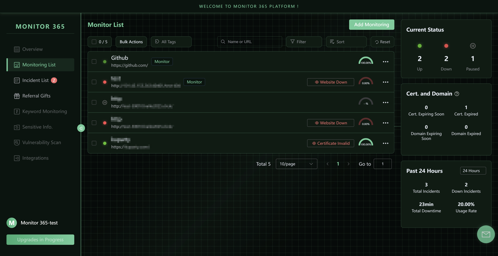
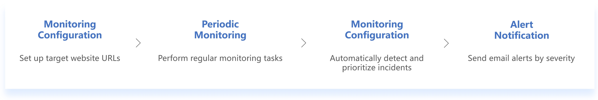
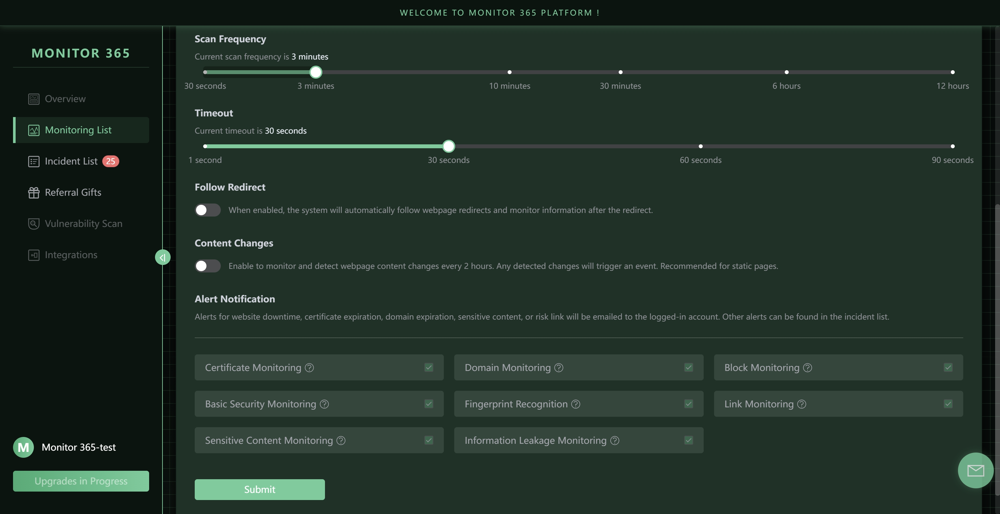
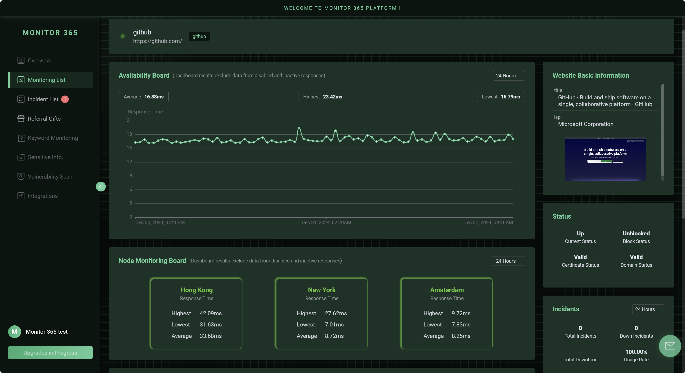
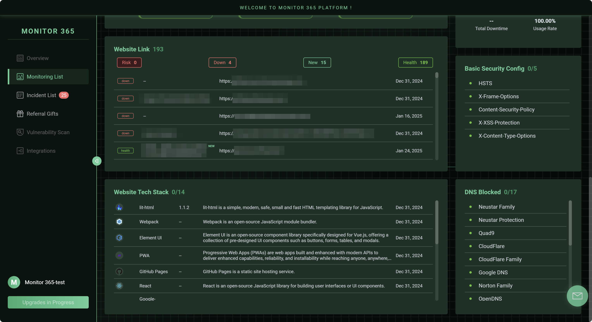
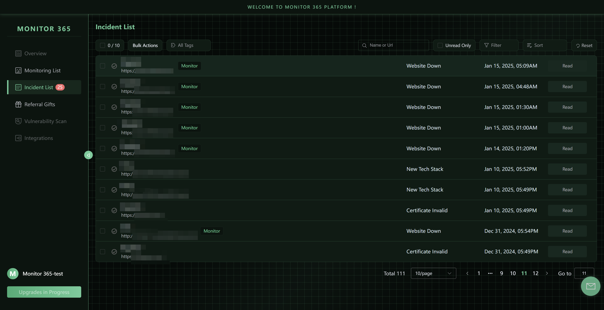
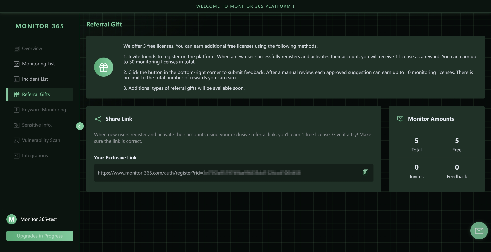
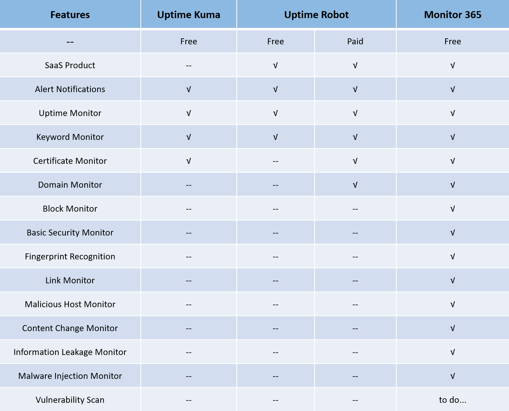

✍️**Preface**

Welcome to trying out Monitor 365! As a startup product, the project team is progressively refining and expanding the product's features. **Once the product reaches a stable state, we will release the source code as open-source.**

You can leave any questions or suggestions regarding the product here, or contact us directly at monitor-365@outlook.com. We hold every user's feedback in the highest regard and look forward to your reviews!

📚**Product Description**

**https://www.monitor-365.com/**

Monitor 365 utilizes globally distributed nodes to simulate user visits, combined with technologies such as fingerprint recognition, web crawlers, and vulnerability scanning. It periodically collects data from target websites and conducts comprehensive analyses from multiple perspectives, including **availability, certificates, domains, DNS, tech stacks, external links, keywords (in development), sensitive information (in development), and vulnerabilities (in development)**.
The platform proactively identifies potential threats or anomalies that could compromise website availability and security. By delivering real-time alerts, it empowers users to address issues swiftly, ensuring the stability, resilience, and overall health of their websites.

🔀**Full Workflow**

After users configure the target website, Monitor 365 initiates periodic monitoring tasks. Based on task results, it automatically detects incidents that could compromise the website’s health, classifies them by severity, and sends alert notifications based on the criticality of each issue. This streamlined approach empowers users to maintain comprehensive oversight of their website’s security posture and overall performance.

📱**Core Features**

- **Availability Monitoring:** Globally distributed, node-based monitoring with multi-level validation for uptime and responsiveness
- **Certificate Monitoring:** Retrieves information about the website’s certificate issuer, validity period, and verifies certificate trustworthiness.
- **Domain Monitoring:** Checks domain registration details and validates expiration status.
- **Blocking Detection:** Identifies DNS-level restrictions on the target website.
- **Fingerprint Recognition:** Utilizes a proprietary, self-developed engine to analyze and track changes in the website's tech stack
- **External Link Monitoring:** Captures external link data, tracks new additions, and assesses their health.
- **Basic Security Monitoring:** Ensures the website is configured with HTTP security headers.
- **Keyword Monitoring (In Development):** Compares website content to a keyword database to ensure compliance
- **Sensitive Info. Monitoring (In Development):** Detects leaks of personal identification data, emails, API keys, and other sensitive information
- **Vulnerability Scan (In Development):** Detects website vulnerabilities, assesses severity, and provides remediation recommendations.
- **Monitoring Tasks:** Conducts periodic scans for comprehensive website health assessment.
- **Alert Notifications:** Sends alert notifications based on incidents severity

📷**Core Features Screenshot**

🆚**Competitive Comparison**

Monitor 365, a 24/7 platform for website availability and security monitoring, **provides all features free of charge**. Unlike conventional products, it provides a comprehensive suite of features, including blocking detection, fingerprint recognition, external link monitoring, basic security checks, keyword detection (in development), sensitive information monitoring(in development), and vulnerability scanning(in development). **This all-in-one solution addresses diverse website monitoring needs efficiently.**

