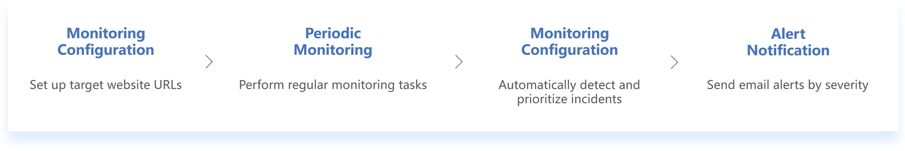
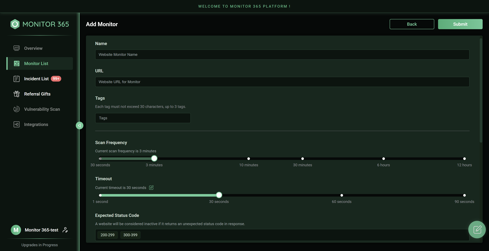
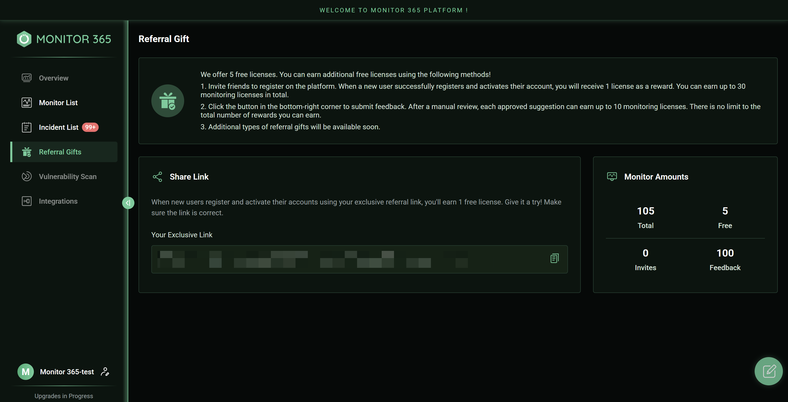
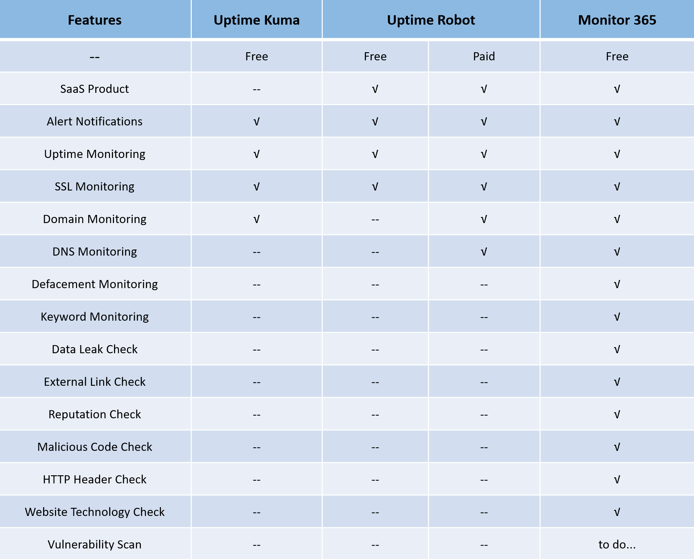

✍️**Preface**

Welcome to trying out Monitor 365! As a startup product, the project team is progressively refining and expanding the product's features. **Once the product reaches a stable state, we will release the source code as open-source.**

You can leave any questions or suggestions regarding the product here, or contact us directly at monitor-365@outlook.com. We hold every user's feedback in the highest regard and look forward to your reviews!

📚**Product Description**

**https://monitor365.online/**

Monitor 365 utilizes globally distributed nodes to simulate user visits, combined with technologies such as fingerprint recognition, web crawlers, and vulnerability scan. It periodically collects data from target websites and conducts comprehensive analyses from multiple perspectives, including **uptime, SSL certificates, domains, IPs, DNS, tech stacks, links, website defacement, keywords, data leaks, malicious code, and vulnerabilities (in development)**.
The platform proactively identifies potential threats or anomalies that could compromise website security and uptime. By delivering real-time alerts, it empowers users to address issues swiftly, ensuring the stability, resilience, and overall health of their websites.

🔀**Full Workflow**

After users configure the target website, Monitor 365 initiates periodic monitoring tasks. Based on task results, it automatically detects incidents that could compromise the website’s health, classifies them by severity, and sends alert notifications based on the criticality of each issue. This streamlined approach empowers users to maintain comprehensive oversight of their website’s security posture and overall performance.

📱**Core Features**

- **Uptime Monitoring:** Globally distributed, node-based monitoring with multi-level validation for uptime and responsiveness.
- **SSL Monitoring:** Retrieves information about the website’s certificate issuer, validity period, and verifies certificate trustworthiness.
- **Domain Monitoring:** Checks domain registration details and validates expiration status.
- **DNS Monitoring:** Identifies DNS-level restrictions on the target website.
- **Defacement Monitoring:** Monitor website content changes and locate the modified parts.
- **Keyword Monitoring:** Compares website content to a keyword database to ensure compliance.
- **Data Leak Check:** Detects exposure of PII, Cloud Keys, and other sensitive information.
- **External Link Check:** Captures link data, tracks new additions, and assesses their health.
- **Reputation Check:** Extract referenced domains or IPs on the website and assess their risk.
- **Malicious Code Check:** Detect if the website has been injected with malicious code.
- **HTTP Header Check:** Ensures the website is configured with HTTP security headers.
- **Website Technology Check:** Utilizes a proprietary, self-developed engine to analyze and track changes in the website's technology stack.
- **Vulnerability Scan (In Development):** Detects website vulnerabilities, assesses severity, and provides remediation recommendations.
- **Monitoring Tasks:** Conducts periodic scans for comprehensive website health assessment.
- **Alert Notifications:** Sends alert notifications based on incidents severity.

📷**Core Features Screenshot**

🆚**Competitive Comparison**

Monitor 365, a 24/7 platform for website security and uptime monitoring, **provides all features free of charge**. Unlike conventional products, it provides a comprehensive suite of features, including DNS monitoring, website defacement monitoring, keyword monitoring, data leak check, external link check, reputation check, malicious code check, HTTP Header check, website technology check and vulnerability scan(in development) . **This all-in-one solution addresses diverse website monitoring needs efficiently.**

